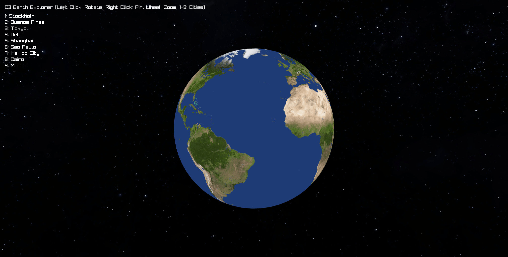

<a href="https://c3-lang.org">
  
</a>

### C3 Earth Explorer

3D Earth visualization built with [C3](https://c3-lang.org) and [Raylib](https://github.com/raysan5/raylib).

<p align="center">
  <a href="https://manulinares.github.io/c3-earth/">
    
  </a>
</p>

## Controls
- **Left Click**: Rotate globe
- **Right Click**: Drop pins
- **Mouse Wheel**: Zoom
- **Keys 1-9**: Jump to cities

## How to Run
```bash
c3c run
```

## Web Build
```bash
c3c build web
```
